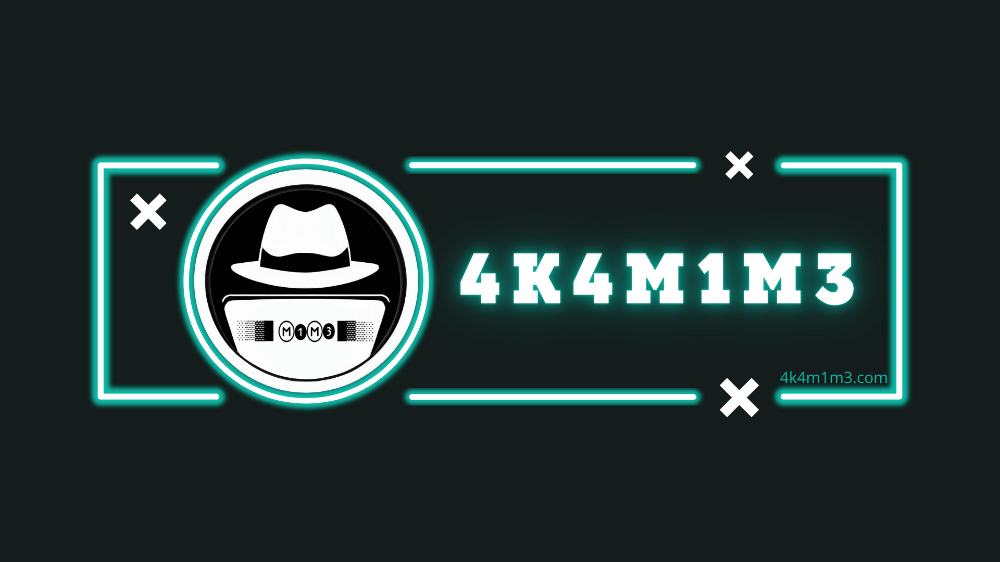

  

# 4k4m1m3

### Learning • Building • Automating • Sharing

---

## 👋 ¿Qué es 4k4m1m3?

**4k4m1m3** es mi laboratorio personal, donde experimento, desarrollo y comparto proyectos relacionados con:

- 🐧 Linux
- 🛡️ Cybersecurity
- ⚙️ Automatización
- 🏠 Homelab
- 🌐 Open Source
- 🤖 Inteligencia Artificial
- 📈 Trading & Finanzas

Aquí encontrarás herramientas, scripts, pruebas de concepto, documentación técnica y proyectos personales en constante evolución.

---

## 🚀 Proyectos

Algunos de los proyectos que desarrollo y documento:

- 🛡️ Homelab SOC
- ⚙️ Automatización para Linux
- 💻 Herramientas Open Source
- 📊 Dashboards y utilidades
- 🧪 Experimentos y Proof of Concept

---

## 🌐 Más contenido

📖 Blog

👉 https://4k4m1m3.com

---

## 👨‍💻 ¿Buscas mi perfil profesional?

Mi portafolio profesional, experiencia y proyectos principales se encuentran en:

👉 **https://github.com/wuilmerbolivar**

---

*"Aprender. Construir. Compartir."*

⭐ Gracias por visitar este laboratorio.

