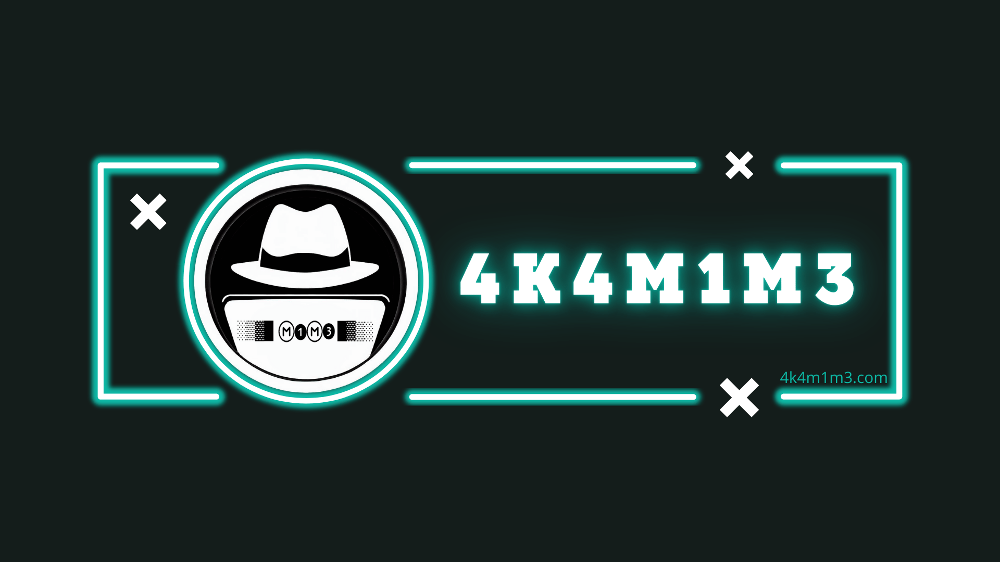

    

        
    

    

        
    

 

$$
\huge\text{La ética, la humildad y el conocimiento son la clave para ser un hacker ético.}
$$

 

Hola, soy **Wuilmer Bolívar**, conocido como **@4k4m1m3**, soy un **profesional en tecnología** con más de 10 años de experiencia en el sector de la **seguridad informática**, la **administración de sistemas Linux y Windows**, y el **monitoreo de redes**. Actualmente, me especializo en la **optimización de infraestructuras tecnológicas**, **automatización de procesos**, y en la implementación de soluciones que **mejoren la seguridad y eficiencia** operativa de las empresas.

## 🚀 **¿Qué hago?**

En mi día a día:

- **Realizo pruebas de penetración** y auditorías de seguridad para evaluar la resiliencia de los sistemas.
- Desarrollo herramientas y **scripts de automatización** para facilitar tareas complejas en Linux y Windows.
- Administro **infraestructuras de servidores**, mejorando el rendimiento y seguridad.
- Actualmente me estoy preparando para certificarme como **eJPTv2**, lo que refleja mi compromiso con la mejora continua en el ámbito de la **ciberseguridad**.

## 🛠 **Habilidades Técnicas**

Me apasiona explorar nuevas herramientas y tecnologías, y aquí te dejo una lista de mis conocimientos actuales:

### **Lenguajes y Herramientas**

| **Lenguajes** | **Herramientas** | **Sistemas Operativos** |
|---------------|------------------|-------------------------|
| Python 🐍 | **Metasploit** | Kali Linux 🐧 |
| Bash 🖥️ | **Wireshark** | Debian 🐧 |
| C/C++ 💻 | **Nmap** | Windows 🪟 |
| MySQL 🦀 | **Burp Suite** | Parrot OS 🐧 |
| PHP 🔨 | **Hydra** | Ubuntu 🐧 |

### **Ciberseguridad**

| **Red Team** | **Blue Team** | **General** |
|--------------|---------------|-------------|
| **Metasploit** | **Suricata** | **Wireshark** |
| **Nmap** | **Zeek** | **Firewall** |
| **Hydra** | **Wazuh** | **Splunk** |

## 🌱 **¿Qué estoy aprendiendo?**

- Me encuentro ampliando mis conocimientos sobre **Red Team** y **Blue Team**.
- Actualmente estoy trabajando en un **proyecto de automatización** para escanear vulnerabilidades en redes y servidores, usando **Nmap** y **Metasploit** de manera automatizada.
- **Preparándome para obtener nuevas certificaciones** como **eJPTv2** y **CompTIA Security+**.

## 📬 **Contacta conmigo**

- **LinkedIn**: [Perfil de LinkedIn](https://www.linkedin.com/in/4k4m1m3/)
- **Mi Web**: [4k4m1m3.com](https://4k4m1m3.com)

## 🌍 **Mi misión**

Estoy comprometido con **aprender constantemente** y **compartir conocimientos** en ciberseguridad, administración de sistemas y redes. Mi objetivo es **ayudar a pequeñas empresas** y **personas** a **mejorar su seguridad** digital, optimizando sus infraestructuras tecnológicas y protegiéndolas contra posibles amenazas.

### 💡 **¡Apóyame!**
Si alguna de mis herramientas o proyectos te ha sido útil o deseas apoyarme en mi camino, ¡invitame un café y ayuda a que continúe desarrollando más proyectos como este! ☕️ [¡Apóyame aquí!](https://ko-fi.com/akamime)

## 🎯 **Proyectos y contribuciones**

Soy un firme creyente en el software libre, por lo que siempre busco contribuir con mis proyectos a la comunidad. En este repositorio podrás encontrar herramientas que he desarrollado, como el **EjecutarAplicacionesWSL.bat**, que facilita la ejecución de aplicaciones gráficas en **Parrot OS** sobre **WSL2** en **Windows**.

Si tienes sugerencias, mejoras o simplemente quieres colaborar en algún proyecto, ¡no dudes en abrir un **issue** o **pull request**!

## 💬 **Contribuye**
Si deseas contribuir a mis proyectos, siempre estoy abierto a recibir **feedback** y **mejoras**. Si tienes alguna sugerencia, ¡no dudes en contactarme!

---
